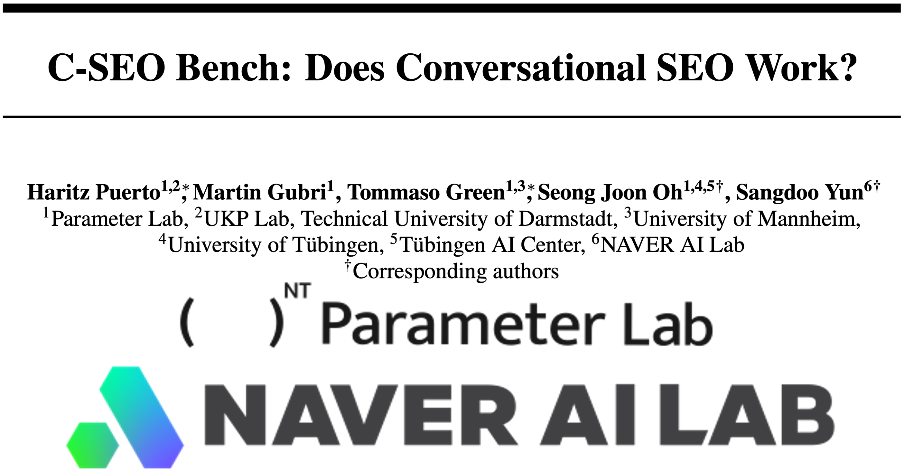
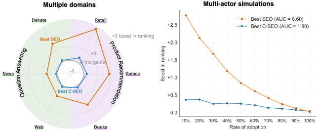

[](https://huggingface.co/datasets/parameterlab/c-seo-bench) [](https://huggingface.co/datasets/parameterlab/c-seo-results)



This repository includes the code to i) run C-SEO methods to improve documents, ii) run the C-SEO Bench on the improved documents, iii) evaluate the performance of the C-SEO method.

Developed at [Parameter Lab](https://parameterlab.de/) with the support of [Naver AI Lab](https://clova.ai/en/ai-research).





> **Abstract**:
Large Language Models (LLMs) are transforming search engines into Conversational Search Engines (CSE). Consequently, Search Engine Optimization (SEO) is being shifted into Conversational Search Engine Optimization (C-SEO). We are beginning to see dedicated C-SEO methods for modifying web documents to increase their visibility in CSE responses. However, they are often tested only for a limited breadth of application domains; we do not understand whether certain C-SEO methods would be effective for a broad range of domains. Moreover, existing evaluations consider only a single-actor scenario where only one web document adopts a C-SEO method; in reality, multiple players are likely to competitively adopt the cutting-edge C-SEO techniques, drawing an analogy from the dynamics we have seen in SEO. We present C-SEO Bench, the first benchmark designed to evaluate C-SEO methods across multiple tasks, domains, and number of actors. We consider two search tasks, question answering and product recommendation, with three domains each. We also formalize a new evaluation protocol with varying adoption rates among involved actors. Our experiments reveal that most current C-SEO methods are largely ineffective, contrary to reported results in the literature. Instead, traditional SEO strategies, those aiming to improve the ranking of the source in the LLM context, are significantly more effective. We also observe that as we increase the number of C-SEO adopters, the overall gains decrease, depicting a congested and zero-sum nature of the problem.


# How to Use

## Setup
First, install the requirements

```
conda create --name cseo python=3.12
conda activate cseo
pip install -e .
```
Update the keys from your OpenAI/Anthropic accounts in `config.json`.

## Optional: Download the results from our paper

```bash
cd scripts
python download_results.py
```

It will create a folder in the root of the project called cseo_results. The folder will have the following structure `{partition}/{method}/{model}`. In each leaf folder you will find two files:
* `cost.json`: the cost of running the experiment
* `responses.parquet` a file to be open with pandas including the prompt, response, and list of extracted citations from the responses.


## 1. Prepare the documents to improve

> Please note we have already released the documents modified with our C-SEO methods in `data/{partition}/selected_docs.json`


The notebook `notebooks/1_prepare_documents_to_improve.ipynb` will load the benchmark and allow you to select the documents you want to improve. By default, given a query and a list of documents, it will pick one random document and will store it in `data/{split_name}/selected_docs.json`, which will have the following shape: 

```python
{data_point_index: {document_index: {'doc': ...}}}
```

## 2. Run C-SEO methods
> Please note we have already released the documents modified with our C-SEO methods in `data/{partition}/selected_docs.json`

The notebook `notebooks/2_run_cseo_method.ipynb` will load the selected documents from the prior step, and will run a C-SEO method to improve the documents. The notebook will allow you to choose your preferred method from the ones we include in `src/methods`. The file `data/{split_name}/selected_docs.json` will be updated with the improved version of the documents. The new form of the `selected_docs.json` will be:

```python
{data_point_index: {document_index: {'doc': ..., f"{method}(doc)": ...}}}
```

## 3. Run C-SEO Bench
After improving the documents with a C-SEO method (step 2), now you can run the C-SEO Bencharmk. `notebooks/3_run_cseo_bench.ipynb` will setup run a Convsersational Search Engine with those improved documents.


## 4. Run the Evaluation

If you want to evaluate the results from the paper, you can download the results from [https://huggingface.co/datasets/parameterlab/c-seo-results](https://huggingface.co/datasets/parameterlab/c-seo-results) and then run `notebooks/4_evaluation.ipynb`. You can also use this notebook to evaluate your own results obtained from the prior steps. This notebook will calculate the increase in the rankings of a document improved by a C-SEO method. Don't forget to run step 3 without running any C-SEO method too (i.e., the baseline).


## Credits
This work was supported by the NAVER corporation.


## Disclaimer

> This repository contains experimental software and is published for the sole purpose of giving additional background details on the respective publication. 

✉️ Contact person: Haritz Puerto, haritz.puerto@tu-darmstadt.de

https://www.parameterlab.de/

Don't hesitate to send us an e-mail or report an issue if something is broken (and it shouldn't be) or if you have further questions.